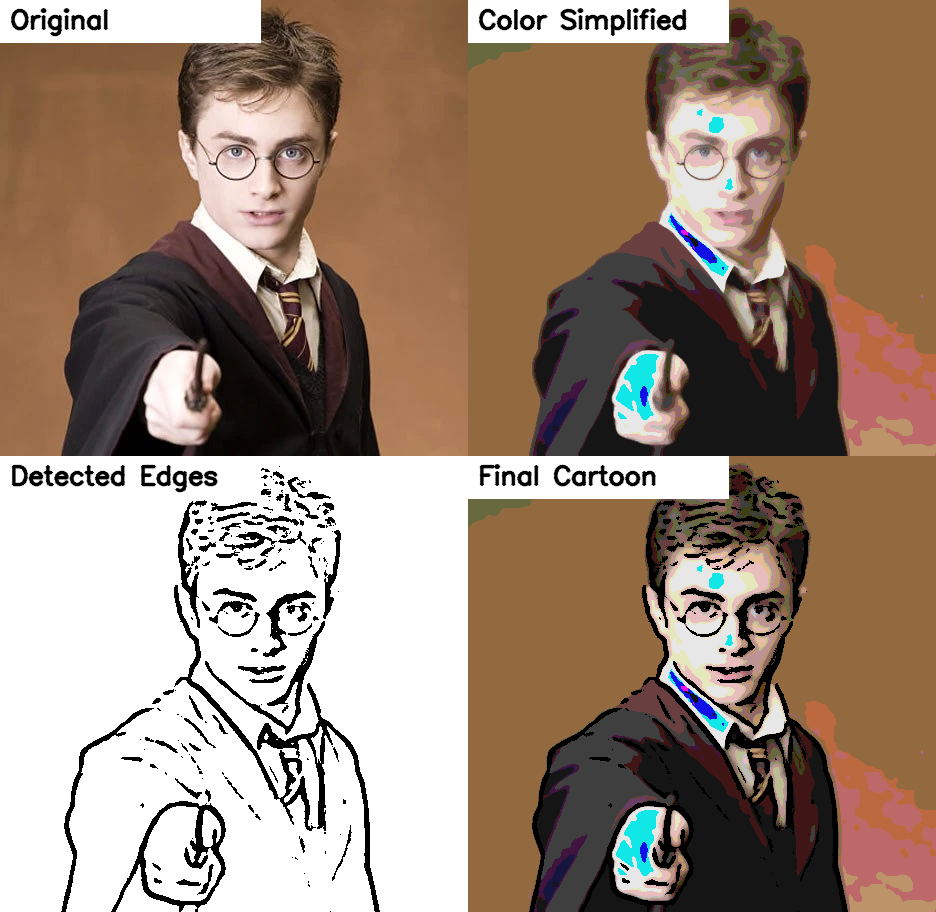
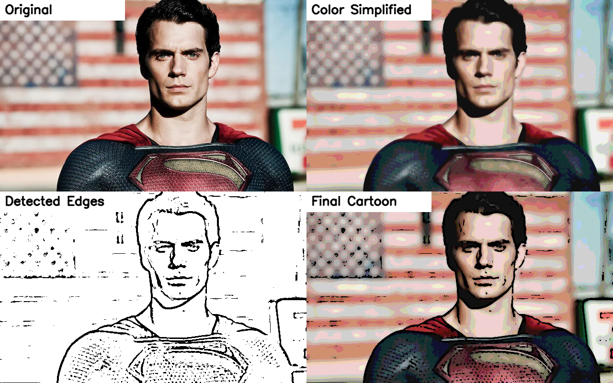
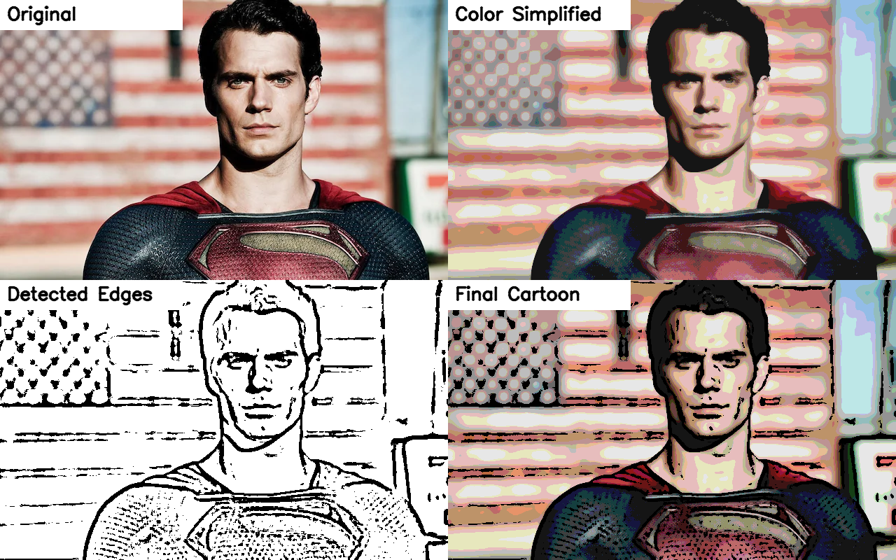
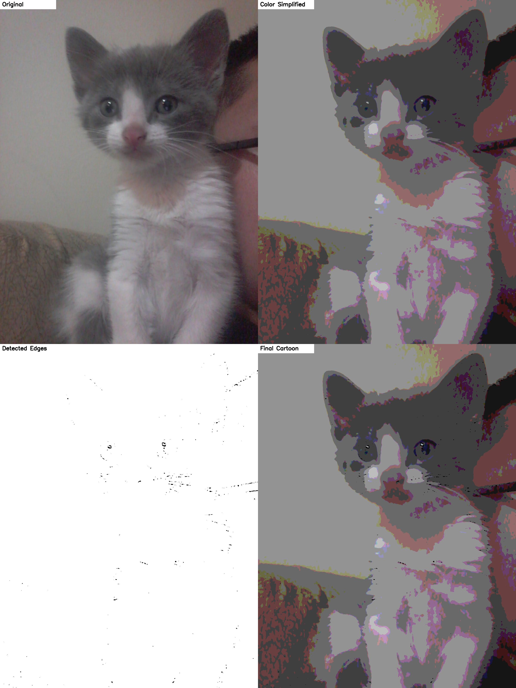
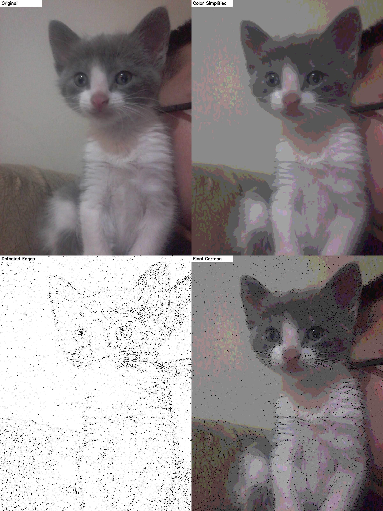
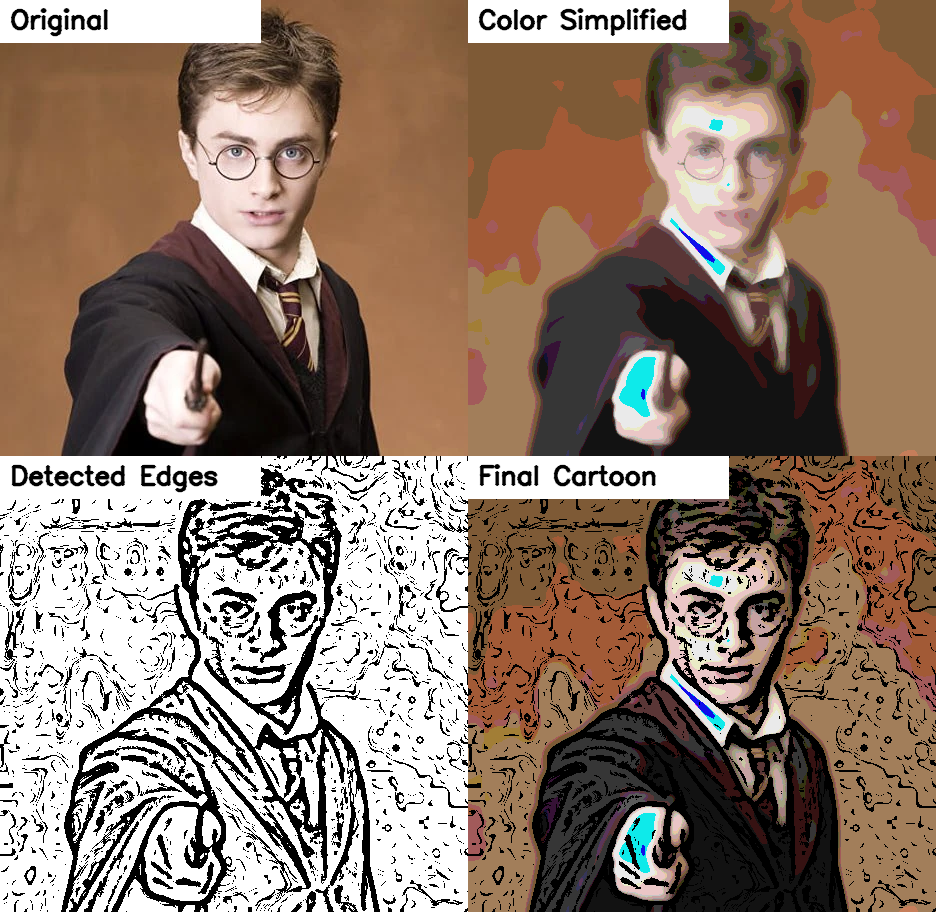

# ToonVision

ToonVision is an OpenCV-based cartoon rendering project that transforms ordinary images into stylized cartoon-like outputs using classical computer vision and image processing techniques. Instead of relying on deep learning, the project uses a clear and interpretable pipeline based on grayscale conversion, noise reduction, adaptive edge extraction, bilateral smoothing, and color quantization.

---

## Comparative Results

These comparison panels are intentionally placed at the beginning of the README to immediately show the visual effect of the algorithm and how different parameter settings change the final cartoon style.

### Default vs. Bold Comic Effect

| Subject | Default Results | Bold Comic Effects (Bolder & Flatter) |
| :--- | :--- | :--- |
| **Harry Potter** |  |  |
| **Superman** |  |  |
| **Busy Landscape**|  |  |
| **Kitten (Low Light)**|  |  |


#### Image Where the Cartoon Effect Works Well

The algorithm performs well on images with:

- clear subject boundaries
- moderate to strong lighting
- limited noise
- distinct color regions

Portraits such as Harry Potter and Superman are good examples because their facial structure, clothing, and silhouette remain recognizable after color simplification and edge masking.

#### Image Where the Cartoon Effect Is Not Well Expressed

Low-light or noisy images are more challenging for this method. The kitten example is a useful failure case because the original image has weak contrast and unstable texture information. Under default settings, the edge map may become too weak or incomplete, which reduces the cartoon effect.

## Case Study: Evolution of the Kitten Example

| Strategy | Result | Analysis |
| :--- | :--- | :--- |
| **1. Default** |  | The default settings struggle with low contrast, so important contours are not strongly extracted and the cartoon effect appears weak. |
| **2. Bold Comic** |  | Thicker outlines and flatter colors make the stylization more noticeable, although the dark lighting still limits contour clarity in some regions. |
| **3. Ultra-Sensitive** |  | More aggressive thresholding improves the visibility of whiskers, eyes, and facial boundaries, making the structure of the subject easier to recognize. |
| **4. Painterly Smooth** |  | Stronger smoothing reduces noise and creates a softer illustration-like appearance, but it may also remove some fine detail. |

### Parameter Trade-off Example

There is no single parameter combination that works best for every image.

| Subject | Default (Ideal) | Painterly Smooth (Over-smoothed) |
| :--- | :--- | :--- |
| **Harry Potter** |  |  |
| **Analysis** | Sharp edges, readable facial details, and balanced colors. | Too much smoothing removes fine facial detail and weakens structure. |

This illustrates a key limitation of classical image processing: parameters often need to be tuned depending on lighting conditions, texture complexity, and subject type.

---

## Project Overview

This project was developed for a cartoon rendering assignment in Computer Vision. The program processes **all supported images inside an input directory**, applies the same cartoonization pipeline to each one, and saves multiple outputs for analysis and presentation:

- the **final cartoon result**
- the **detected edge map**
- the **color-simplified image**
- a **2x2 comparison canvas** with labeled intermediate and final results

This makes the project useful not only for generating cartoon-like images, but also for understanding how each stage of the pipeline contributes to the final visual effect.

---

## How the Algorithm Works

The implementation in `cartoon_stylizer.py` follows a classical OpenCV workflow:

1. **Grayscale conversion**  
   The original image is converted to grayscale so that edges can be extracted more reliably.

2. **Median blur**  
   A median filter is applied to reduce small noise before thresholding. This helps stabilize edge detection.

3. **Adaptive thresholding**  
   The blurred grayscale image is converted into a binary edge map using adaptive thresholding. This produces strong black-and-white outlines.

4. **Bilateral filtering**  
   The original color image is smoothed while preserving major edges. This reduces texture noise without destroying important boundaries.

5. **Color quantization**  
   The number of color levels is reduced to create flatter, more posterized color regions, which are visually closer to cartoon shading.

6. **Edge masking**  
   The simplified color image is combined with the edge map using a bitwise mask, producing the final cartoon-style rendering.

---

## Pipeline Summary

```text
Input Image
   │
   ├──> Grayscale
   │       │
   │       └──> Median Blur
   │               │
   │               └──> Adaptive Threshold
   │                       │
   │                       └──> Edge Map
   │
   └──> Bilateral Filter
           │
           └──> Color Quantization
                   │
                   └──> Simplified Colors

Simplified Colors + Edge Map
           │
           └──> Final Cartoon Output
```

---

## Main Features

- Processes **all images in a directory**
- Supports common image formats: `.jpg`, `.jpeg`, `.png`, `.webp`, `.bmp`
- Saves **four outputs per image**
- Offers command-line control over the most important stylization parameters
- Can optionally display the last processed image using OpenCV windows
- Generates labeled comparison panels that are easy to place in a report or README

---

## Repository Structure

```text
ToonVision/
├── cartoon_stylizer.py
├── requirements.txt
├── .gitignore
├── README.md
├── Inputs/
│   ├── gato.jpeg
│   ├── harry.webp
│   ├── input.jpeg
│   └── superman.webp
├── outputs_default/
├── outputs_bold_comic/
├── outputs_ultra_sensitive/
└── outputs_painterly_smooth/
```

---

## Requirements

- Python 3.10+
- OpenCV
- NumPy

Install dependencies with:

```bash
pip install -r requirements.txt
```

---

## How to Run

### Basic Usage

The script takes an **input directory** and processes all supported images inside it.

```bash
python cartoon_stylizer.py Inputs/ --output-dir outputs
```

### Show the Final Processed Image in a Window

```bash
python cartoon_stylizer.py Inputs/ --output-dir outputs --show
```

### Example with Custom Parameters

```bash
python cartoon_stylizer.py Inputs/ \
  --output-dir outputs_custom \
  --median-ksize 5 \
  --adaptive-block-size 11 \
  --adaptive-c 7 \
  --bilateral-d 9 \
  --bilateral-sigma-color 220 \
  --bilateral-sigma-space 220 \
  --color-levels 6
```

---

## Command-Line Arguments

| Argument | Description | Default |
| :--- | :--- | :--- |
| `input_dir` | Directory containing input images | required |
| `--output-dir` | Directory where processed results are saved | `outputs` |
| `--median-ksize` | Kernel size for median blur | `5` |
| `--adaptive-block-size` | Neighborhood size for adaptive thresholding (odd number) | `9` |
| `--adaptive-c` | Constant subtracted in adaptive thresholding | `9` |
| `--bilateral-d` | Neighborhood diameter for bilateral filtering | `9` |
| `--bilateral-sigma-color` | Color sigma for bilateral filtering | `250` |
| `--bilateral-sigma-space` | Spatial sigma for bilateral filtering | `250` |
| `--color-levels` | Approximate number of discrete color levels | `8` |
| `--show` | Display the last processed image before exiting | disabled |

---

## Output Files

For each input image, the script saves four `.png` files in the output directory:

- `*_cartoon.png` → final cartoon-style image
- `*_edges.png` → binary edge map
- `*_simplified.png` → color-quantized image before masking
- `*_comparison.png` → labeled 2x2 panel showing:
  - Original
  - Color Simplified
  - Detected Edges
  - Final Cartoon

For example, if the input file is `harry.webp`, the program will generate:

- `harry_cartoon.png`
- `harry_edges.png`
- `harry_simplified.png`
- `harry_comparison.png`

---

## Technical Breakdown: How the Parameters Affect the Image

Different cartoon styles can be obtained by changing the core parameters of the pipeline.

### 1. Noise Reduction

- **`--median-ksize`** controls the strength of the median blur.
- Smaller values preserve fine details.
- Larger values remove more noise, but can also erase texture and soften details.

### 2. Edge Extraction

- **`--adaptive-block-size`** controls the local neighborhood used to compute the threshold.
- Smaller values are more sensitive to local detail.
- Larger values tend to produce bolder, broader outlines.

- **`--adaptive-c`** shifts the threshold value.
- Lower values make edge detection more sensitive.
- Higher values suppress weak edges and noise.

### 3. Color Smoothing

- **`--bilateral-d`**, **`--bilateral-sigma-color`**, and **`--bilateral-sigma-space`** determine how strongly the color image is smoothed while preserving edges.
- Higher values usually create flatter, cleaner color regions.
- Excessive smoothing can remove useful details.

### 4. Color Quantization

- **`--color-levels`** controls the number of available color levels.
- Lower values create a flatter, stronger posterization effect.
- Higher values preserve more color variation and look less stylized.

---

## Style Presets and Example Commands

### 1. Default Style
Balanced settings for general-purpose cartoonization.

```bash
python cartoon_stylizer.py Inputs/ --output-dir outputs_default
```

### 2. Bold Comic Style
Creates thicker outlines and flatter colors.

```bash
python cartoon_stylizer.py Inputs/ \
  --output-dir outputs_bold_comic \
  --adaptive-block-size 11 \
  --adaptive-c 7 \
  --bilateral-sigma-color 220 \
  --bilateral-sigma-space 220 \
  --color-levels 6
```

### 3. Ultra-Sensitive Style
More aggressive edge detection for dark or low-contrast images.

```bash
python cartoon_stylizer.py Inputs/ \
  --output-dir outputs_ultra_sensitive \
  --median-ksize 3 \
  --adaptive-block-size 3 \
  --adaptive-c -1 \
  --bilateral-d 15 \
  --bilateral-sigma-color 150 \
  --bilateral-sigma-space 150 \
  --color-levels 12
```

### 4. Painterly Smooth Style
Applies heavier smoothing for a softer, illustration-like appearance.

```bash
python cartoon_stylizer.py Inputs/ \
  --output-dir outputs_painterly_smooth \
  --median-ksize 7 \
  --adaptive-block-size 9 \
  --adaptive-c 1 \
  --bilateral-sigma-color 300 \
  --bilateral-sigma-space 300 \
  --color-levels 7
```

---

## Limitations

This algorithm is intentionally simple and interpretable, but it has several limitations:

1. **It is highly parameter-dependent.**  
   The best settings for one image may produce poor results on another.

2. **Low-light and low-contrast images are difficult.**  
   If edges are weak in the original image, the final cartoon effect may also be weak.

3. **Complex backgrounds can reduce visual clarity.**  
   Highly textured scenes may produce too many edges or visual clutter.

4. **Fine details can be lost.**  
   Strong smoothing and low color levels can remove useful small structures.

5. **The method is not content-aware.**  
   Unlike deep learning methods, this classical pipeline does not understand faces, objects, or scene semantics. It only manipulates pixel patterns.

