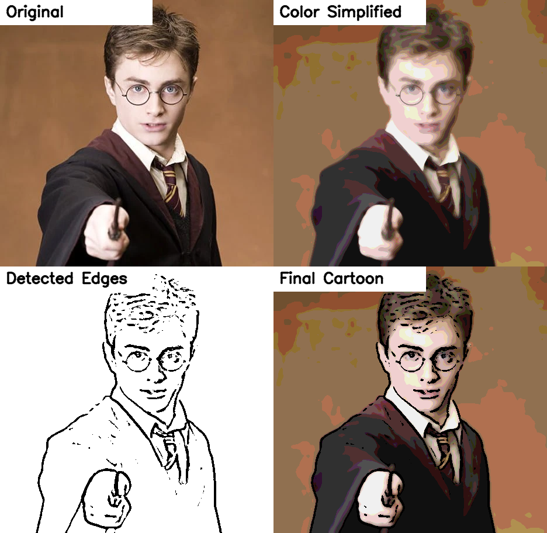
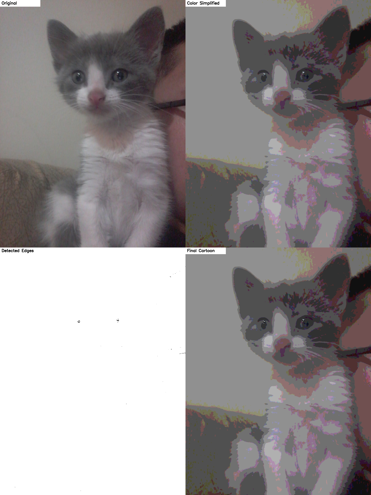
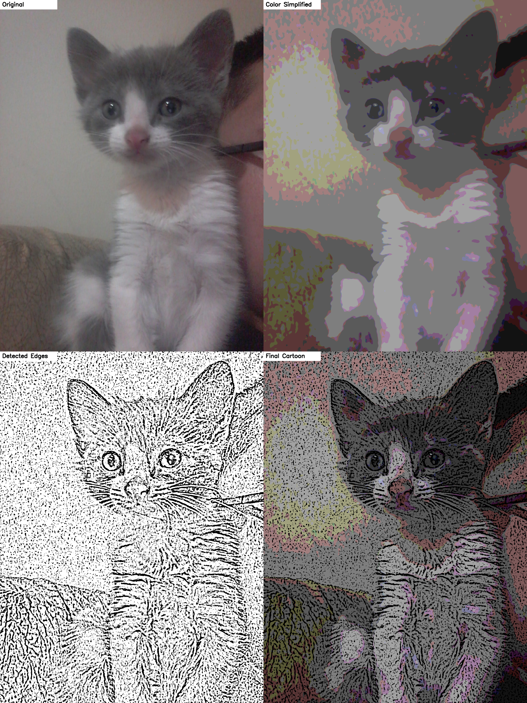

# ToonVision

ToonVision is a computer vision project built with OpenCV that converts ordinary images into cartoon-style renderings using classical image processing techniques. The pipeline combines edge extraction, noise reduction, and color smoothing to simplify visual details and create a cartoon-like effect while preserving the main structure of the original image. This project was developed to explore non-deep-learning approaches for image stylization through traditional computer vision methods.

---

## Repository name suggestion

**ToonVision**

This name is specific and cleaner than generic names such as `hw2`, `cv_homework2`, or `cartoon_hw`, which the slides explicitly discourage. The slides also require a repository description. Example: **"OpenCV cartoon rendering for turning photos into simple cartoon-style images."** fileciteturn0file0

---

## What this program does

The program takes an input image and applies a cartoon-style rendering pipeline:

1. Convert the image to grayscale.
2. Apply median blur to reduce small noise.
3. Extract strong edges using adaptive thresholding.
4. Smooth colors using bilateral filtering.
5. Reduce color complexity with simple color quantization.
6. Combine the simplified colors with the edge mask.


---

## Project structure

```text
ToonVision/
├── cartoon_stylizer.py
├── requirements.txt
├── .gitignore
├── README.md
├── Inputs/
│   ├── gato.jpeg
│   ├── harry.webp
│   ├── input.jpeg
│   └── superman.webp
└── outputs/
```

---

## Requirements

- Python 3.10+
- OpenCV
- NumPy

Install dependencies:

```bash
pip install -r requirements.txt
```

---

## How to run

The program now processes all images within a specified directory.

Basic example (processes all images in `Inputs/`):

```bash
python cartoon_stylizer.py Inputs/ --output-dir outputs
```

Show windows for the last processed image:

```bash
python cartoon_stylizer.py Inputs/ --output-dir outputs --show
```

Try stronger / different effects:

```bash
python cartoon_stylizer.py Inputs/ \
  --output-dir outputs \
  --adaptive-block-size 11 \
  --adaptive-c 7 \
  --bilateral-sigma-color 220 \
  --bilateral-sigma-space 220 \
  --color-levels 6
```

---

## Output files

For each input image in the directory (e.g., `gato.jpeg`), the program saves:

- `outputs/cat_cartoon.png` → final cartoon result
- `outputs/cat_edges.png` → detected edge map
- `outputs/cat_simplified.png` → color-simplified image
- `outputs/cat_comparison.png` → 2x2 comparison panel for presentation 

---

## Advanced Customization: Default vs. Strong Effects

The algorithm's appearance can be drastically changed by adjusting the command-line arguments. This section explains how these parameters affect the computer vision pipeline.

### **Parameter Breakdown**
- `--color-levels`: Controls the "Posterization" effect. Lower values (e.g., 6) result in fewer, flatter color regions, giving a more hand-drawn look.
- `--adaptive-block-size`: Controls the thickness of the outlines. A larger block size (e.g., 11) creates bolder, more dramatic edges.
- `--bilateral-sigma-*`: Controls how much the colors are smoothed while preserving edges. Higher values remove more fine-grain texture noise.

### **Side-by-Side Comparison**

| Subject | Default Results | Stronger Effects (Bolder & Flatter) |
| :--- | :--- | :--- |
| **Harry Potter** |  |  |
| **Superman** |  |  |
| **Busy Landscape**|  |  |
| **Kitten (Low Light)**|  |  |

### **Analysis of Strong Effects**
Using the command below, we can achieve a much more stylized "comic book" aesthetic:

```bash
python cartoon_stylizer.py Inputs/ \
  --output-dir outputs_strong \
  --adaptive-block-size 11 \
  --adaptive-c 7 \
  --bilateral-sigma-color 220 \
  --bilateral-sigma-space 220 \
  --color-levels 6
```

- **Why it looks "better" for portraits**: In the Harry Potter and Superman examples, the **bolder edges** (`block-size 11`) help define the silhouette against the background, and the **reduced colors** (`levels 6`) hide subtle skin gradients, making it look like a drawing rather than a filtered photo.

### **Case Study: Evolution of the "Kitten" (Low-Contrast Challenge)**

The image of the kitten is our most difficult case due to low light and noise. Here is how different CV strategies impact the final result:

| Strategy | Result | Analysis |
| :--- | :--- | :--- |
| **1. Default** |  | **Failure**: The contrast is too low for default settings. The edge map is blank, and the result is just a blurry, pixelated photo. |
| **2. Ultra-Sensitive** |  | **Improvement**: By using a negative `adaptive-c` and small `block-size`, we force the detection of whiskers and eyes. However, it introduces "pepper noise" (fine black dots). |
| **3. Masterpiece** |  | **Best for Kitten**: Using a larger `median-ksize (7)` and `bilateral-sigma (300)`, we clean the noise first. This creates a smooth, painterly look that works beautifully for this specific photo. |

#### **The Parameter Trade-off (Visual Comparison)**
It is important to note that **there is no "one-size-fits-all" command**. A configuration that fixes a noisy image might degrade a high-quality one.

| Subject | Default (Ideal) | Masterpiece (Over-smoothed) |
| :--- | :--- | :--- |
| **Harry Potter** |  |  |
| **Analysis** | Sharp edges, clear facial details, and balanced colors. | **Issue**: The high `median-ksize (7)` and `bilateral-sigma (300)` blur out the fine details of the face and wand. The image loses its "comic book" definition and starts looking like a blurry painting. |

- **Conclusion**: Classical Computer Vision requires parameter tuning based on the specific characteristics (lighting, noise, detail) of the input image. Low-light photos (Kitten) need heavy smoothing, while high-quality portraits (Harry) need sharper edge detection.

---

The slides require two kinds of demo examples in `README.md`:

1. An image where the cartoon feeling is expressed well.
2. An image where the cartoon feeling is **not** expressed well.
3. A discussion of the limitations of the algorithm. fileciteturn0file0

Below is a ready-to-use structure you can keep in your GitHub README.

### Demo 1 — Image where the algorithm works well

**Recommended image type:**
- clear object boundaries
- simple background
- good lighting
- saturated colors
- portraits, toys, anime figures, cars, or objects with strong outlines

**Why it works well:**
- the edge detector can find clean boundaries
- the bilateral filter preserves major contours
- color quantization creates flatter, cartoon-like color regions

**Add your screenshots here:**

```markdown
### Good Example

Original image and result:


Observation:
The cartoon effect is clear because the subject has strong edges, simple lighting,
and color regions that can be simplified without losing the main shape.
```

### Demo 2 — Image where the algorithm does not work well

**Recommended difficult image type:**
- cluttered background
- very fine textures (grass, hair, leaves, fabric)
- low contrast
- noisy or blurry photo
- shadows covering the subject

**Why it fails more easily:**
- too many small edges are detected
- detailed textures can become noisy black lines
- subtle gradients may be turned into harsh flat regions
- the result may look messy instead of cleanly cartoon-like

**Add your screenshots here:**

```markdown
### Bad Example

Original image and result:


Observation:
The cartoon effect is weaker because the image contains many textures and background details.
Instead of simplifying the scene nicely, the algorithm keeps too many unwanted edges.
```

---

## Limitations of this algorithm

This section is explicitly required by the homework slides. fileciteturn0file0

You can use the following discussion directly in your README:

### Limitations

1. **Texture-heavy scenes are difficult**  
   The algorithm works best on images with clear object boundaries. Images with hair, grass, trees, fabric patterns, or crowded backgrounds often produce too many edge lines.

2. **Lighting conditions matter**  
   Strong shadows or low-contrast images can lead to broken or inaccurate edges.

3. **Limited artistic control**  
   This is a classical image processing pipeline, not a learned style-transfer model. It produces a simple cartoon effect, but it cannot imitate a specific anime, comic, or painterly style.

4. **Flat regions may lose detail**  
   Color quantization simplifies the image, but sometimes important details are also removed.

5. **Parameter sensitivity**  
   The output quality depends on parameter choices such as threshold block size, bilateral filter strength, and number of color levels.

6. **Not semantically aware**  
   The algorithm does not understand objects. It only processes pixels and edges, so it cannot selectively enhance faces, eyes, or important regions the way a more advanced AI model could.

---

## Key functions

### `cartoonize_image(...)`
Performs the complete cartoon rendering pipeline.

### `make_comparison_canvas(...)`
Creates a single comparison image with:
- Original
- Color Simplified
- Detected Edges
- Final Cartoon

This is useful for the README screenshot requirement mentioned in the slides. fileciteturn0file0

---

## Suggested images for submission

To maximize your score, use:

### Good case
- action figure
- portrait with plain background
- toy car
- colorful building with strong edges
- food photo with clear boundaries

### Bad case
- tree leaves
- crowded street
- group photo with complex background
- animal fur close-up
- low-light indoor scene

---

## GitHub submission checklist

Based on the slides, before submitting make sure you have all of the following: fileciteturn0file0

- [ ] New GitHub repository created
- [ ] Specific repository name, not a generic homework name
- [ ] Repository description added
- [ ] `README.md` included
- [ ] Program explanation included
- [ ] Feature explanation included
- [ ] Screenshot or video included in the repository
- [ ] Good demo example included
- [ ] Bad demo example included
- [ ] Limitation discussion included
- [ ] Repository stays public until the semester ends
- [ ] Submit the GitHub repository URL before the deadline

---

## Example README result section

You can paste this section directly after generating your own images:

```markdown
## Results

### Good Example


This image produces a strong cartoon effect because the subject is clearly separated from the background,
and the major edges are preserved well.

### Bad Example


This image produces a weaker cartoon effect because the scene has many fine textures and complicated background details,
which create too many unnecessary edges.
```

---

## Notes

- The homework deadline in the slides is **March 24, 2026, 23:59**. fileciteturn0file0
- The submission is the **GitHub repository URL**. fileciteturn0file0
- The grading is an ON/OFF checklist based on whether the required conditions are satisfied. fileciteturn0file0

